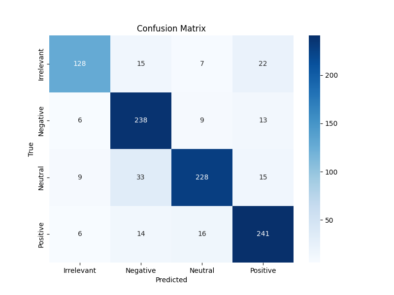

# Twitter Sentiment Analysis using Logistic Regression

This project involves sentiment analysis on Twitter comments using a Logistic Regression model. The project focuses on classifying the sentiment (`feeling`) of comments into predefined categories based on the provided training and validation datasets.

## Table of Contents

- [Introduction](#introduction)
- [Dataset](#dataset)
- [Installation](#installation)
- [Modeling Process](#modeling-process)
- [Results](#results)
- [Visualization](#visualization)
- [License](#license)

## Introduction

Sentiment analysis is the task of classifying the emotional tone behind a body of text. This project aims to perform sentiment analysis on Twitter comments by training a Logistic Regression model using a TF-IDF feature representation.

## Dataset

The dataset contains Twitter comments and their corresponding sentiment labels (referred to as `feeling`). The project uses two datasets:
- `twitter_training.csv`: The training dataset.
- `twitter_validation.csv`: The validation dataset.

The datasets include two columns:
- `comment`: The actual Twitter comment (text).
- `feeling`: The sentiment label associated with the comment.

## Installation

1. Clone the repository:
    ```bash
    git clone https://github.com/your-username/twitter-sentiment-analysis.git
    cd twitter-sentiment-analysis
    ```

2. Install the required packages:
    ```bash
    pip install -r requirements.txt
    ```

3. Place the `twitter_training.csv` and `twitter_validation.csv` files in the project directory.

### Dependencies
- pandas
- scikit-learn
- seaborn
- matplotlib

You can install these using the `requirements.txt` or individually as shown below:
```bash
pip install pandas scikit-learn seaborn matplotlib
```

## Modeling Process

1. **Data Preprocessing**:
   - Loaded the training and validation datasets.
   - Combined the datasets for consistency and cleaned by dropping rows with missing comments.

2. **Feature Extraction**:
   - Used `TfidfVectorizer` to convert the comments into TF-IDF features. A vocabulary size of 5000 terms was set to limit the number of features.

3. **Model**:
   - Trained a Logistic Regression model using the training data.

4. **Evaluation**:
   - Evaluated the model on the validation set using metrics like accuracy, classification report, and confusion matrix.

## Results

- **Accuracy**: The model achieved an accuracy of **X.XX%** on the validation set.
- **Classification Report**:
    ```
    Precision, Recall, and F1-scores for each class will be shown here.
    ```

## Visualization

The confusion matrix provides a visual representation of how well the model performed across the different sentiment classes.
- *Confusion Matrix*:
    


